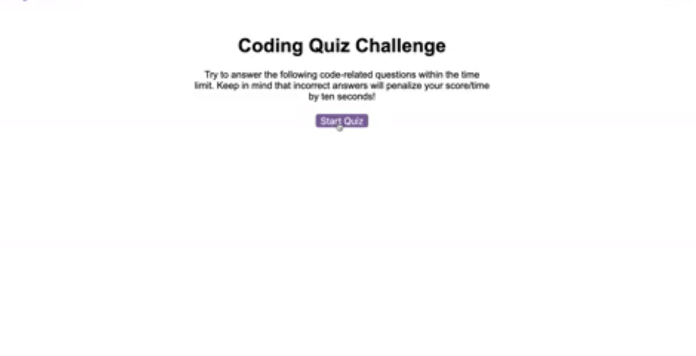
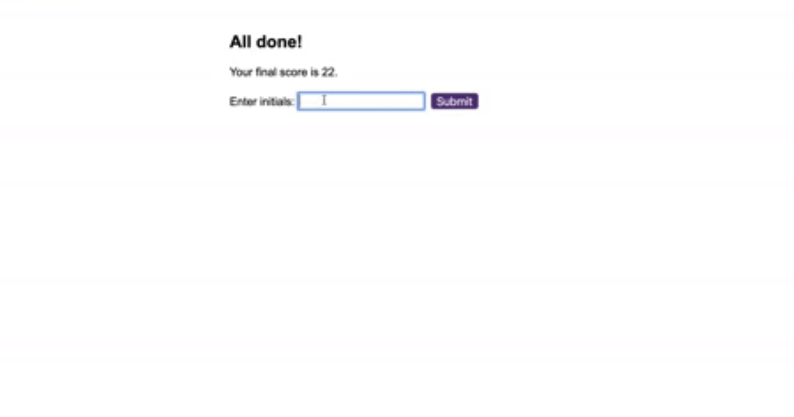

# Code Quiz
    
## Table of Contents
* [Description](#description) 
* [Installation](#installation)
* [Usage](#usage)
* [Credits](#credits)
* [License](#license)
* [Badge](#badge)
* [Questions](#questions)
    
## Description
* Quiz using javascript to run
    
## Installation
* no installation necessary.  Use web browser to go to website and run quiz.
    
## Usage
* Quiz is started by pressing the start button and simply answer the questions.  Post your score at the end of the quiz.

    
## Credits
* N/A
    
## License
* Licensed by mit
    
## Badge
* 
    
## Questions
* For any questions, concerns, or additional help, please contact klucas72@hotmail.com.